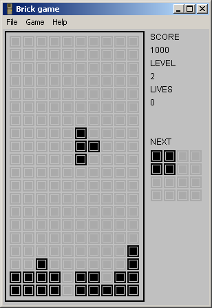

# Brick Game Win32

## About the project

Brick Game Win32 is a collection of mini games, similar to the old handheld game console with the same name from the 1990s.
Currently it contains 2 games; a tetris and a snake game. It runs on all windows systems from Win95 up to Windows 10 and on ReactOS.

## Compiling & Licence

The project can be compiled from Visual Studio 6 up to the Visual Studio 2019 after importing.
The code is in the public domain.
